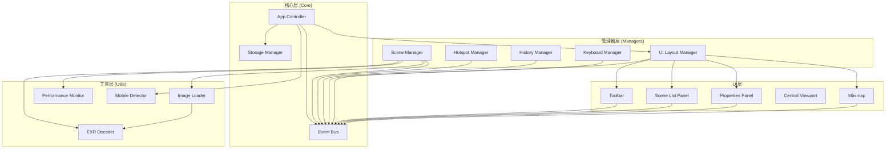
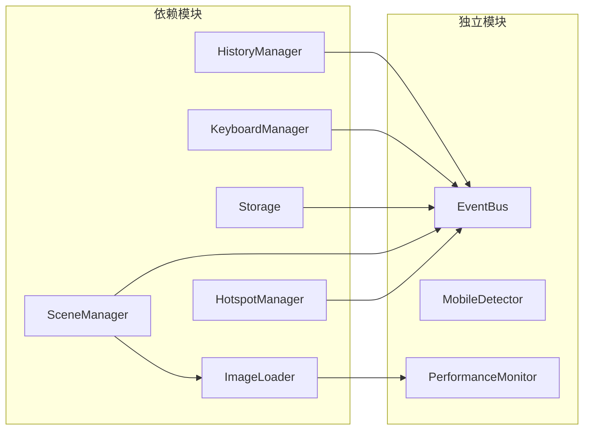
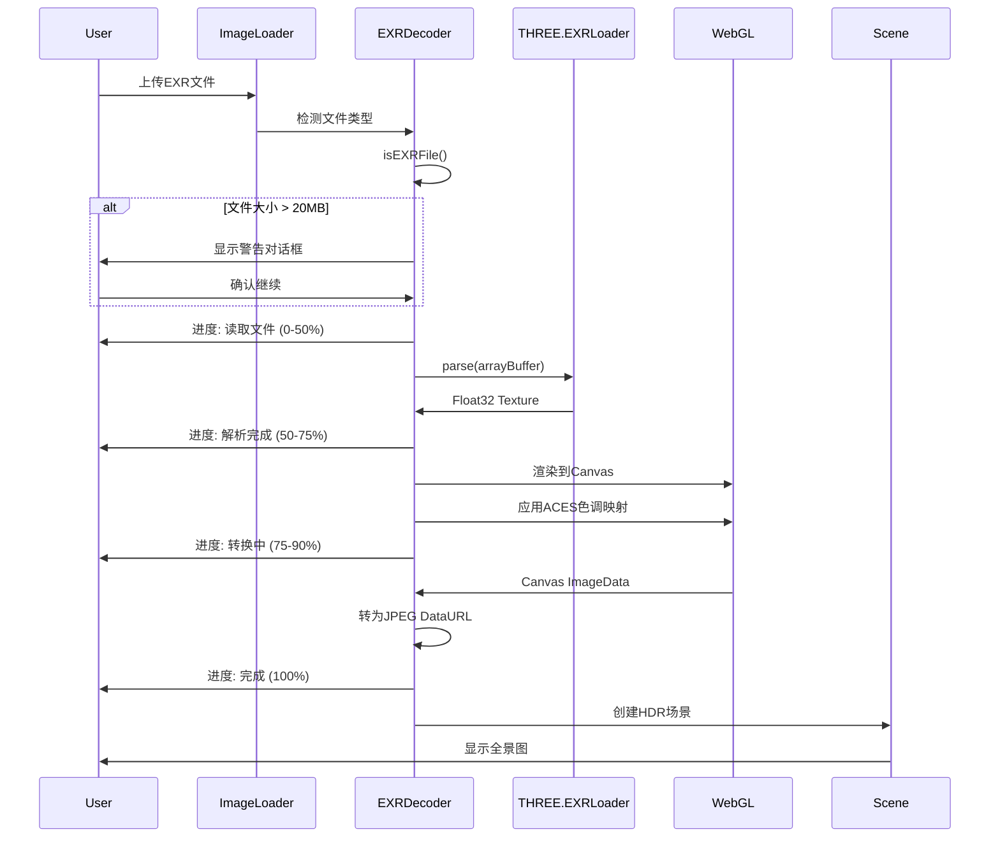
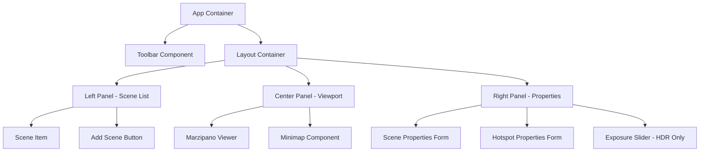

# Design Document

## Overview

本设计文档描述全景编辑器（Pano Viewer）高优先级优化项目的技术架构和实现方案。项目采用模块化架构，将现有的单文件应用重构为多个独立模块，同时实现性能优化、撤销/重做、快捷键系统和移动端适配等功能。

### 设计目标

1. **模块化**: 将代码按职责分离为独立模块，便于维护和测试
2. **性能**: 优化图片加载和内存管理，提升用户体验
3. **可扩展**: 通过事件系统和插件机制支持功能扩展
4. **跨平台**: 支持桌面和移动端的统一体验

## Architecture

### 整体架构图



### 模块依赖关系



## Components and Interfaces

### 1. EventBus（事件总线）

负责模块间的解耦通信。

```javascript
interface EventBus {
  // 订阅事件
  on(event: string, handler: Function): void;
  
  // 取消订阅
  off(event: string, handler: Function): void;
  
  // 发布事件
  emit(event: string, data?: any): void;
  
  // 一次性订阅
  once(event: string, handler: Function): void;
}
```

**事件列表**:
- `scene:added` - 场景添加
- `scene:removed` - 场景删除
- `scene:switched` - 场景切换
- `hotspot:added` - 热点添加
- `hotspot:removed` - 热点删除
- `history:changed` - 历史状态变化
- `keyboard:shortcut` - 快捷键触发
- `performance:warning` - 性能警告

### 2. ImageLoader（图片加载器）

负责图片的渐进式加载和缓存管理。

```javascript
interface ImageLoader {
  // 渐进式加载图片
  loadProgressive(url: string, options?: LoadOptions): Promise<ImageResult>;
  
  // 生成缩略图
  generateThumbnail(imageData: string, size: number): Promise<string>;
  
  // 预加载图片列表
  preload(urls: string[]): Promise<void>;
  
  // 清除缓存
  clearCache(): void;
  
  // 获取缓存状态
  getCacheStats(): CacheStats;
}

interface LoadOptions {
  onProgress?: (percent: number) => void;
  thumbnailSize?: number;
  quality?: 'low' | 'medium' | 'high';
}

interface ImageResult {
  thumbnail: string;
  fullImage: string;
  width: number;
  height: number;
  loadTime: number;
}
```

### 3. HistoryManager（历史管理器）

负责操作历史的记录和撤销/重做功能。

```javascript
interface HistoryManager {
  // 执行并记录操作
  execute(action: Action): any;
  
  // 撤销
  undo(): boolean;
  
  // 重做
  redo(): boolean;
  
  // 状态查询
  canUndo(): boolean;
  canRedo(): boolean;
  
  // 清空历史
  clear(): void;
  
  // 获取历史信息
  getInfo(): HistoryInfo;
}

interface Action {
  name: string;
  execute(): any;
  undo(): void;
  redo?(): any;
}

interface HistoryInfo {
  canUndo: boolean;
  canRedo: boolean;
  historySize: number;
  currentIndex: number;
}
```

### 4. KeyboardManager（键盘管理器）

负责快捷键的注册和处理。

```javascript
interface KeyboardManager {
  // 注册快捷键
  register(key: string, handler: Function, description?: string): void;
  
  // 注销快捷键
  unregister(key: string): void;
  
  // 启用/禁用
  setEnabled(enabled: boolean): void;
  
  // 获取所有快捷键
  getAll(): ShortcutInfo[];
  
  // 检查是否在输入状态
  isInputFocused(): boolean;
}

interface ShortcutInfo {
  key: string;
  description: string;
}
```

### 5. MobileDetector（移动端检测器）

负责设备检测和移动端优化。

```javascript
interface MobileDetector {
  // 设备信息
  isMobile: boolean;
  isTablet: boolean;
  isIOS: boolean;
  isAndroid: boolean;
  orientation: 'portrait' | 'landscape';
  
  // 获取完整设备信息
  getDeviceInfo(): DeviceInfo;
  
  // 应用移动端优化
  applyMobileOptimizations(): void;
  
  // 检测陀螺仪支持
  checkGyroscopeSupport(): Promise<boolean>;
  
  // 获取推荐配置
  getRecommendedImageQuality(): 'low' | 'medium' | 'high';
  getRecommendedMaxResolution(): number;
}
```

### 6. PerformanceMonitor（性能监控器）

负责性能指标的监控和报告。

```javascript
interface PerformanceMonitor {
  // 开始/停止监控
  start(): void;
  stop(): void;
  
  // 获取性能报告
  getReport(): PerformanceReport;
  
  // 测量操作耗时
  measureLoadTime(name: string, callback: Function): Promise<any>;
  
  // 显示/隐藏面板
  showPanel(): void;
  hidePanel(): void;
}

interface PerformanceReport {
  currentFPS: number;
  averageFPS: number;
  minFPS: number;
  maxFPS: number;
  memory?: MemoryInfo;
  loadTime: number;
}
```

### 7. SceneManager（场景管理器）

负责场景的创建、切换和资源管理。

```javascript
interface SceneManager {
  // 场景操作
  createScene(imageData: string, name: string): Promise<Scene>;
  switchScene(sceneId: string, options?: SwitchOptions): void;
  deleteScene(sceneId: string): void;
  
  // 资源管理
  unloadInactiveScenes(keepCount: number): void;
  reloadScene(sceneId: string): Promise<void>;
  
  // 查询
  getScene(sceneId: string): Scene | null;
  getAllScenes(): Scene[];
  getCurrentScene(): Scene | null;
}

interface SwitchOptions {
  transition?: 'none' | 'fade' | 'zoom' | 'blur';
  duration?: number;
}
```

### 8. EXRDecoder（EXR解码器）

负责EXR格式文件的解码和HDR处理。

```javascript
interface EXRDecoder {
  // 检测是否为EXR文件
  isEXRFile(file: File): boolean;
  
  // 解码EXR文件
  decode(file: File, options?: EXRDecodeOptions): Promise<EXRResult>;
  
  // 应用色调映射
  applyToneMapping(texture: THREE.Texture, options: ToneMappingOptions): string;
  
  // 调整曝光
  adjustExposure(imageData: string, exposure: number): Promise<string>;
  
  // 获取EXR元数据
  getMetadata(file: File): Promise<EXRMetadata>;
}

interface EXRDecodeOptions {
  onProgress?: (stage: string, percent: number) => void;
  maxSize?: number; // 最大文件大小（字节）
  quality?: number; // 输出JPEG质量（0-1）
}

interface EXRResult {
  imageData: string; // Base64 JPEG
  thumbnail: string;
  width: number;
  height: number;
  isHDR: boolean;
  metadata: EXRMetadata;
  decodeTime: number;
}

interface ToneMappingOptions {
  algorithm: 'aces' | 'reinhard' | 'uncharted2';
  exposure: number;
  whitePoint?: number;
}

interface EXRMetadata {
  width: number;
  height: number;
  channels: string[];
  compression: string;
  dataType: 'half' | 'float';
  fileSize: number;
}
```

### 9. UILayoutManager（UI布局管理器）

负责720云风格的UI布局管理。

```javascript
interface UILayoutManager {
  // 初始化布局
  initialize(): void;
  
  // 面板管理
  showPanel(panelId: string): void;
  hidePanel(panelId: string): void;
  togglePanel(panelId: string): void;
  
  // 调整面板大小
  resizePanel(panelId: string, width: number): void;
  
  // 布局偏好
  saveLayout(): void;
  loadLayout(): LayoutPreferences;
  resetLayout(): void;
  
  // 响应式处理
  handleResize(): void;
  
  // 小地图
  showMinimap(): void;
  hideMinimap(): void;
}

interface LayoutPreferences {
  leftPanelWidth: number;
  rightPanelWidth: number;
  minimapVisible: boolean;
  minimapPosition: 'bottom-right' | 'bottom-left' | 'top-right' | 'top-left';
}
```

### 10. PropertiesPanel（属性面板）

负责显示和编辑选中对象的属性。

```javascript
interface PropertiesPanel {
  // 显示对象属性
  showSceneProperties(scene: Scene): void;
  showHotspotProperties(hotspot: Hotspot): void;
  showProjectProperties(settings: Settings): void;
  
  // 清空面板
  clear(): void;
  
  // 属性更新回调
  onPropertyChange(callback: (property: string, value: any) => void): void;
}
```

## Data Models

### Scene（场景）

```javascript
interface Scene {
  id: string;
  name: string;
  imageData: string;
  thumbnail: string;
  hotspots: Hotspot[];
  initialView: ViewParameters;
  groupId: string;
  isLoaded: boolean;
  createdAt: number;
  // EXR相关字段
  isHDR: boolean;
  exposure: number;
  exrMetadata?: EXRMetadata;
}

interface ViewParameters {
  yaw: number;
  pitch: number;
  fov: number;
}
```

### Hotspot（热点）

```javascript
interface Hotspot {
  id: string;
  type: 'info' | 'link' | 'image' | 'video' | 'audio';
  title: string;
  content: string;
  style: 'default' | 'pulse' | 'glow';
  yaw: number;
  pitch: number;
}
```

### AppState（应用状态）

```javascript
interface AppState {
  scenes: Scene[];
  currentSceneId: string | null;
  groups: Group[];
  settings: Settings;
  isEditing: boolean;
}

interface Settings {
  autoRotate: boolean;
  rotateSpeed: number;
  autoTour: boolean;
  tourInterval: number;
  initFov: number;
  minFov: number;
  maxFov: number;
  showMinimap: boolean;
  showCompass: boolean;
  showSceneNav: boolean;
  transition: string;
  filter: string;
}
```


## Correctness Properties

*A property is a characteristic or behavior that should hold true across all valid executions of a system-essentially, a formal statement about what the system should do. Properties serve as the bridge between human-readable specifications and machine-verifiable correctness guarantees.*

### Property 1: Progressive Loading Order

*For any* image URL, when loaded through ImageLoader, the thumbnail callback SHALL be invoked before the full image is available, and progress callbacks SHALL report values between 0 and 100.

**Validates: Requirements 1.1, 1.2, 1.4**

### Property 2: Scene Unloading Threshold

*For any* collection of scenes where count exceeds the configured threshold, calling unloadInactiveScenes SHALL result in only the most recently used scenes remaining loaded, with total loaded scenes not exceeding the threshold.

**Validates: Requirements 2.1**

### Property 3: Scene Reload on Switch

*For any* unloaded scene, switching to that scene SHALL trigger a reload, and after the switch completes, the scene's isLoaded property SHALL be true.

**Validates: Requirements 2.2**

### Property 4: Resource Cleanup on Delete

*For any* scene that is deleted, the scene's resources SHALL be removed from the cache, and the scene SHALL no longer appear in getAllScenes().

**Validates: Requirements 2.5**

### Property 5: History Recording

*For any* action executed through HistoryManager.execute(), the history size SHALL increase by 1 (up to maxSize), and canUndo() SHALL return true.

**Validates: Requirements 4.1**

### Property 6: Undo-Redo Round Trip

*For any* sequence of actions executed through HistoryManager, performing undo followed by redo SHALL restore the state to what it was after the original action execution.

**Validates: Requirements 4.2, 4.3**

### Property 7: Undo Boundary

*For any* HistoryManager with empty history or at the earliest state (currentIndex < 0), canUndo() SHALL return false.

**Validates: Requirements 4.4**

### Property 8: Redo Boundary

*For any* HistoryManager at the latest state (currentIndex >= history.length - 1), canRedo() SHALL return false.

**Validates: Requirements 4.5**

### Property 9: New Action Clears Redo History

*For any* HistoryManager where undo has been performed (currentIndex < history.length - 1), executing a new action SHALL clear all history entries after the current position, making canRedo() return false.

**Validates: Requirements 4.6**

### Property 10: History Size Limit

*For any* sequence of actions executed through HistoryManager, the history size SHALL never exceed maxSize, and when the limit is reached, the oldest entries SHALL be removed.

**Validates: Requirements 4.7**

### Property 11: Input Focus Ignores Shortcuts

*For any* keyboard event that occurs while an input element (INPUT, TEXTAREA) is focused, KeyboardManager SHALL not trigger any registered shortcut handlers.

**Validates: Requirements 5.8**

### Property 12: Load Time Recording

*For any* image loaded through ImageLoader, the PerformanceMonitor SHALL record a positive loadTime value after loading completes.

**Validates: Requirements 8.4**

### Property 13: EXR Auto-Detection and Decoding

*For any* file with .exr extension uploaded to the system, the EXRDecoder SHALL be invoked and return valid image data with isHDR flag set to true.

**Validates: Requirements 9.1**

### Property 14: EXR Decode Progress Stages

*For any* EXR file being decoded, the progress callback SHALL be invoked with stages in order (读取 → 解析 → 转换 → 完成) and with monotonically increasing percentages from 0 to 100.

**Validates: Requirements 9.2**

### Property 15: ACES Tone Mapping Application

*For any* decoded EXR texture, the output image data SHALL have all RGB values clamped to the range [0, 1] after ACES Filmic tone mapping is applied.

**Validates: Requirements 9.3**

### Property 16: Exposure Adjustment Updates Image

*For any* HDR scene and any exposure value in range [0.1, 5.0], adjusting the exposure SHALL produce different image data and update the scene's exposure property to the new value.

**Validates: Requirements 9.4**

### Property 17: EXR Error Type Mapping

*For any* invalid EXR input (corrupted data, unsupported format, oversized file), the decoder SHALL throw an error with a specific type field matching the failure reason.

**Validates: Requirements 9.6**

### Property 18: HDR Scene Metadata Display

*For any* scene where isHDR is true, the scene info display SHALL contain both an HDR badge indicator and the exrMetadata fields.

**Validates: Requirements 9.7**

### Property 19: Scene Selection Highlights Active

*For any* scene in the scene list, clicking it SHALL result in that scene becoming the current scene and having the highlighted CSS class applied.

**Validates: Requirements 10.2**

### Property 20: Properties Panel Shows Hotspot Data

*For any* hotspot that is selected, the properties panel SHALL display all required fields: position (yaw, pitch), type, content, and style.

**Validates: Requirements 10.3**

### Property 21: Toolbar Button Action Mapping

*For any* toolbar button, clicking it SHALL trigger the corresponding action or display the corresponding UI component.

**Validates: Requirements 10.4**

### Property 22: Layout Preferences Round Trip

*For any* panel width adjustment, the new width SHALL be saved to localStorage and retrievable via loadLayout().

**Validates: Requirements 10.5**

### Property 23: Minimap Toggle Behavior

*For any* current minimap visibility state (visible or hidden), clicking the minimap button SHALL toggle it to the opposite state.

**Validates: Requirements 10.7**

### Property 24: Toolbar Tooltip Display

*For any* toolbar icon, hovering over it SHALL display a tooltip containing both a description and the associated keyboard shortcut.

**Validates: Requirements 10.8**


## EXR解码流程

### 解码管道



### 色调映射实现

```javascript
// ACES Filmic色调映射着色器
const acesFilmicShader = `
  vec3 ACESFilmic(vec3 x) {
    float a = 2.51;
    float b = 0.03;
    float c = 2.43;
    float d = 0.59;
    float e = 0.14;
    return clamp((x * (a * x + b)) / (x * (c * x + d) + e), 0.0, 1.0);
  }
  
  void main() {
    vec4 texColor = texture2D(tDiffuse, vUv);
    vec3 color = texColor.rgb * exposure;
    color = ACESFilmic(color);
    gl_FragColor = vec4(color, texColor.a);
  }
`;
```

### 曝光调整

用户可以通过滑块实时调整曝光值（0.1 - 5.0），系统会：
1. 重新应用色调映射
2. 更新Canvas渲染
3. 生成新的JPEG DataURL
4. 保存曝光值到场景数据

## UI布局设计（720云风格）

### 布局结构

```
┌─────────────────────────────────────────────────────────────┐
│  Toolbar (顶部工具栏)                                        │
│  [添加场景] [添加热点] [设置] [导出] [撤销] [重做] [帮助]    │
├──────────┬──────────────────────────────────┬───────────────┤
│          │                                  │               │
│  Scene   │                                  │  Properties   │
│  List    │       Central Viewport           │  Panel        │
│  (左侧)  │       (中央视口)                  │  (右侧)       │
│          │                                  │               │
│  [场景1] │                                  │  场景属性:    │
│  [场景2] │      [全景图显示区域]            │  名称: xxx    │
│  [场景3] │                                  │  类型: HDR    │
│  [+新增] │                                  │  曝光: 1.0    │
│          │                                  │               │
│          │                                  │  热点属性:    │
│          │                                  │  标题: xxx    │
│          │                                  │  类型: link   │
│          │         ┌──────────┐             │               │
│          │         │ Minimap  │             │               │
│          │         └──────────┘             │               │
└──────────┴──────────────────────────────────┴───────────────┘
```

### 响应式布局

**桌面端 (≥1024px)**:
- 左侧面板: 250px（可调整 200-400px）
- 右侧面板: 300px（可调整 250-500px）
- 中央视口: 自适应剩余空间

**平板端 (768px - 1023px)**:
- 左侧面板: 200px（固定）
- 右侧面板: 折叠为浮动面板
- 点击属性按钮显示浮动面板

**移动端 (<768px)**:
- 左侧面板: 抽屉式（默认隐藏）
- 右侧面板: 底部弹出式
- 工具栏移至底部

### UI组件层次



### 小地图设计

小地图显示场景间的连接关系：
- 节点：圆形缩略图代表场景
- 连线：箭头表示热点链接方向
- 高亮：当前场景用蓝色边框标识
- 交互：点击节点切换场景

```javascript
interface MinimapNode {
  sceneId: string;
  thumbnail: string;
  position: { x: number; y: number };
  connections: string[]; // 连接的场景ID列表
}
```

## Error Handling

### 图片加载错误

```javascript
// ImageLoader 错误处理
try {
  const result = await imageLoader.loadProgressive(url);
} catch (error) {
  if (error.type === 'network') {
    showToast('网络错误，请检查连接', 'error');
  } else if (error.type === 'format') {
    showToast('不支持的图片格式', 'error');
  } else {
    showToast('图片加载失败', 'error');
  }
  // 保留缩略图或显示占位图
}
```

### 模块初始化错误

```javascript
// 模块加载失败时继续运行
modules.forEach(module => {
  try {
    module.init();
  } catch (error) {
    console.error(`Module ${module.name} failed to initialize:`, error);
    // 记录错误但不阻止其他模块
  }
});
```

### 历史操作错误

```javascript
// 撤销/重做失败时的处理
try {
  historyManager.undo();
} catch (error) {
  console.error('Undo failed:', error);
  showToast('撤销失败', 'error');
  // 可选：清空历史以防止进一步错误
}
```

### EXR解码错误

```javascript
// EXR文件解码错误处理
try {
  const result = await exrDecoder.decode(file, {
    onProgress: (stage, percent) => {
      updateProgressBar(stage, percent);
    }
  });
} catch (error) {
  if (error.type === 'file_too_large') {
    showDialog('文件过大', `文件大小 ${error.size}MB 超过建议的 20MB，可能导致性能问题。是否继续？`, {
      onConfirm: () => retryDecode(file, { maxSize: Infinity })
    });
  } else if (error.type === 'unsupported_format') {
    showToast('不支持的EXR格式（可能是多层或Deep Compositing）', 'error');
  } else if (error.type === 'decode_failed') {
    showToast('EXR解码失败，文件可能已损坏', 'error');
  } else if (error.type === 'webgl_not_supported') {
    showToast('浏览器不支持WebGL 2.0，无法处理EXR文件', 'error');
  } else {
    showToast('EXR处理失败', 'error');
    console.error('EXR decode error:', error);
  }
}
```

### UI布局错误

```javascript
// 布局加载失败时使用默认布局
try {
  const layout = uiLayoutManager.loadLayout();
  uiLayoutManager.applyLayout(layout);
} catch (error) {
  console.warn('Failed to load layout preferences, using defaults:', error);
  uiLayoutManager.resetLayout();
}
```

## Testing Strategy

### 测试框架选择

- **单元测试**: Vitest（快速、兼容 Jest API）
- **属性测试**: fast-check（JavaScript 属性测试库）
- **E2E测试**: Playwright（可选，用于UI测试）

### 单元测试覆盖

1. **ImageLoader**
   - 缓存命中/未命中
   - 进度回调调用
   - 错误处理

2. **HistoryManager**
   - 基本的 execute/undo/redo 流程
   - 边界条件（空历史、最大限制）
   - 状态查询方法

3. **KeyboardManager**
   - 快捷键注册/注销
   - 修饰键组合
   - 输入框焦点检测

4. **MobileDetector**
   - 设备类型检测
   - 方向检测

5. **PerformanceMonitor**
   - FPS 计算
   - 加载时间测量

6. **EXRDecoder**
   - 文件类型检测
   - 解码进度回调
   - 色调映射应用
   - 错误类型分类

7. **UILayoutManager**
   - 面板显示/隐藏
   - 布局保存/加载
   - 响应式断点

8. **PropertiesPanel**
   - 属性显示完整性
   - 属性更新回调

### 属性测试要求

- 使用 fast-check 库进行属性测试
- 每个属性测试运行至少 100 次迭代
- 测试文件使用 `.property.test.js` 后缀
- 每个测试必须注释引用对应的正确性属性

```javascript
// 示例：属性测试格式
import { fc } from 'fast-check';

describe('HistoryManager Properties', () => {
  /**
   * **Feature: pano-viewer-optimization, Property 6: Undo-Redo Round Trip**
   * **Validates: Requirements 4.2, 4.3**
   */
  it('undo followed by redo restores state', () => {
    fc.assert(
      fc.property(fc.array(actionArbitrary), (actions) => {
        // 测试实现
      }),
      { numRuns: 100 }
    );
  });
});
```

